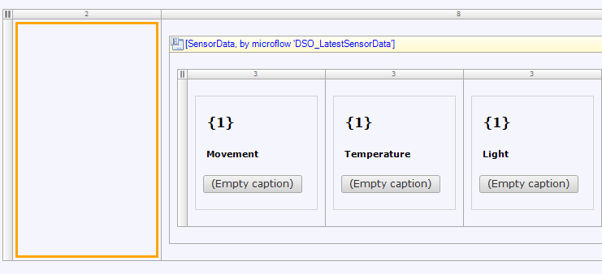
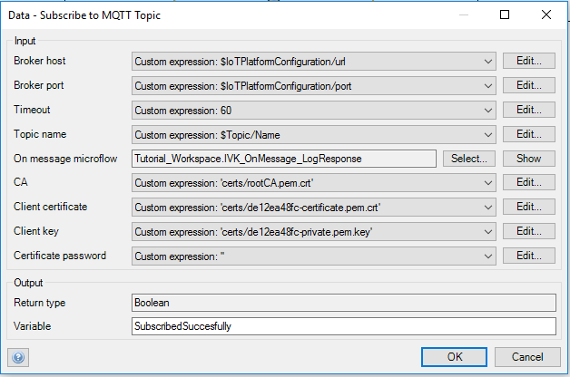

### Step 2 -  Configuring the Sensor Data Subscription

In this section, you will connect a shipment to an IoT device so the data that the device is generating can be used.

To configure the sensor data subscription, follow these steps:

1. In the Modeler, open the **Shipment_Detail** page.
2. Right-click the left-side column of the layout grid (in which **Movement**, **Temperature**, etc. are also located) and select **Add widget** > **Button** > **Call microflow button**.

3. In the **Select Microflow** dialog box, select the **IVK_Subscribe** microflow. You can find it by typing **IVK_Subscribe** in the *Filter* input box.
4. Double-click the button and enter the caption of *Subscribe*.
5. Right-click the button and select **Go to microflow** to inspect the microflow.
    * When invoking a microflow, you can pass the context of a page to it. That enables you to work with all the data assocations from context objects. In this case, the context object is **Shipment**. You can view the structure of the **Shipment** object, which is called an entity, by right-clicking the **Shipment** input parameter and selecting the **Go to entity** option. The Shipment is associated to other entities like **Alert** and **Topic** which means that objects from different entities are related to each other. The relation between a **Shipment** object and a **Topic** object and the relation between a **Topic** object and **IoTPlatformConfiguration** object enables retrieval of the data required for connecting to AWS.
    * Return to the microflow again to see what is happening there. In the outer left activity **Topic** object is retrieved over its association to the **Shipment** object. It is a best practice to check that the association is not empty. If that is **true**, the microflow retrieves the **IoTPlatformConfiguration** object that is associated to the topic. The microflow must check if there is an **IoTPlatformConfiguration** object available. If that is **true**, the data from those objects is used in the subscribe action (via the **AWS IoT Connector**, which is available in the [Mendix App Store](https://appstore.home.mendix.com/link/app/2868/Mendix/AWS-IoT-Connector)). In the subscribe activity a microflow action is configured for the subscription to the topic on AWS. So everytime new data is published on that topic, AWS will send a message to the app with that data and trigger this microflow.
6. Double-click the **Data - Subscribe to MQTT topic** activity and for the **On message microflow**, click **Show** to display the microflow from the details of the connector action. 
7. In the **IVK_OnMessage_LogResponse** microflow, there are two parameters: **Topic** (string) and **Payload** (string). You must log both parameters in the **Console** to verify that you are receiving data (if the Console is not open, click **View** > **Console**).
8. Save the changes, click **Run Locally**, then click **View App**.
9. Refresh the app in the browser, then click **Subscribe** and notice that you get a confirmation message. At this point you won't see anything happening in the app as you configured the app to log the messages it receives from AWS.
10. Return to the Modeler and observe the **Console**. Double-click the log message **Sensor data received**, which will open the **View Log Line Details** pop-up window, where you can see the **Topic** and **Payload** (JSON) in the **Message** section. Receiving this kind of log message means you have just connected to AWS and are receiving real world data!

